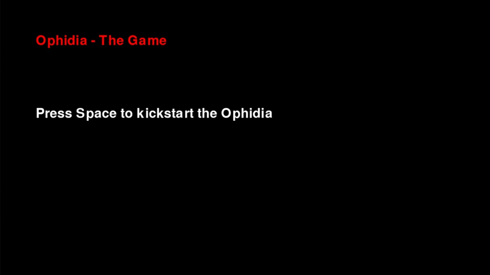
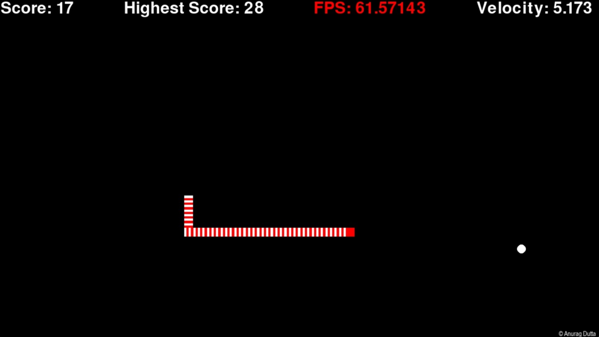

# Ophidia - The Game

A Single Player Locomotion based game controllable using 
- Mouse
- Keyboard

## Screens

## Technology Stack

- Python
- PyGame

## Updates
- Version2.6(Build): Game Loop Disabled. Game Over Concept Invoked
- Version2.7(Build): Game Over Concept Improved
- Version2.8(Build): Game Over Concept Improved and Graphics was Revamped
- Version2.9(Build): Welcome Screen Invoked
- Version2.10(FinalBuild): Audio Added

## Token

